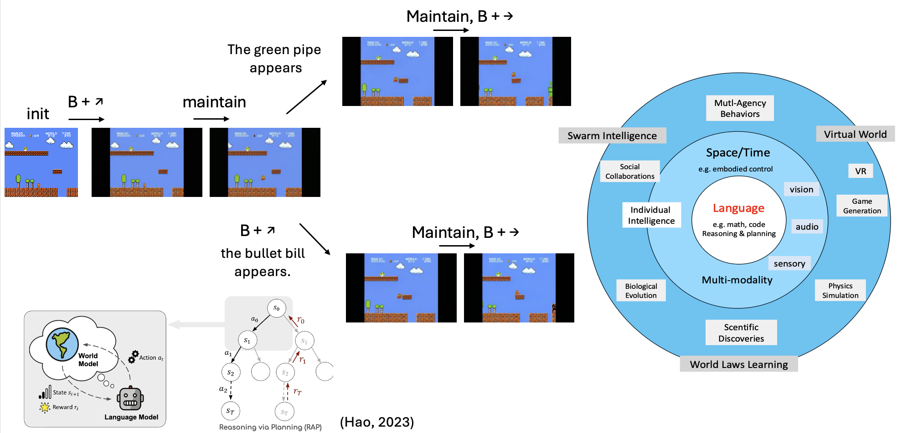

- **Diffusion Game Engine:** Built an auto-regressive Image-to-Video (I2V) model capable of simulating 2D platformer games (e.g., Mario), allowing control of both characters and environmental elements using text inputs on the fly. Proposed and implemented window-slide conditioning to support the generation of game videos lasting longer than one minute.

- **Video Diffusion Model Acceleration:** Spearheaded a sub-project focusing on optimizing video diffusion for real-time game generation, achieving generation speeds of under 1 second per round.

- **Complex Video Captioning:** Led a sub-project aimed at enhancing video captioning for complex scenarios (e.g. game videos) where even state-of-the-art visual language models tend to falter, ensuring more accurate descriptions.

- **Large-Scale Training Data Pipeline:** Designed and implemented a high-efficiency processing pipeline for video training data, processing over 10 million videos simultaneously, significantly improving the overall data quality and processing speed.

